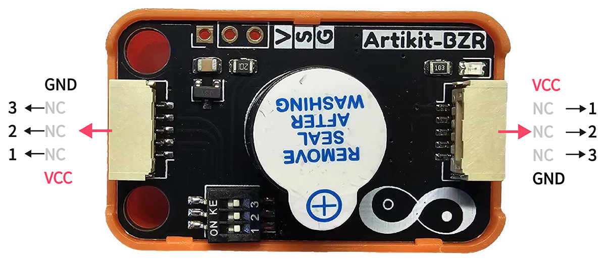
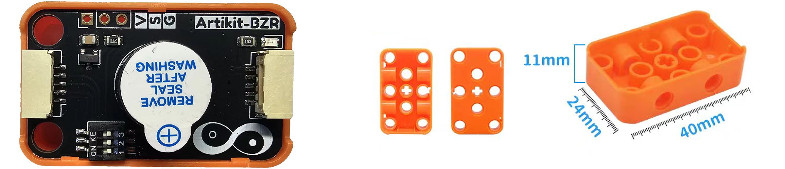
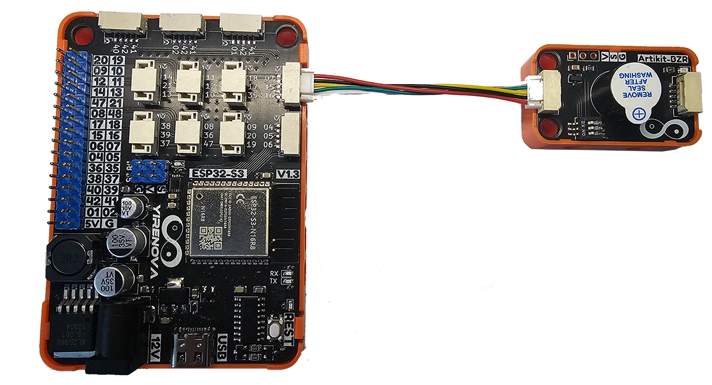

## ⭐ 简介
WS2812是一种可编程的LED灯，具有RGB显示效果，可显示的颜色数量为2^24。

<AccordionGroup>
<Accordion title="参数 & 接口 & 尺寸">

#### ⭐ 参数
- 工作温度：-20 ~ 70℃
- 工作电压：3 ~ 7V
- 工作电流：≤30mA
- 共振频率：2700±200
- 10CM声压值：≥85dB

#### ⭐ 接口


#### ⭐ 尺寸
- 📐 24mm x 40mm x 20mm


</Accordion>
</AccordionGroup>


## ⭐ 如何使用
<AccordionGroup>
<Accordion title="准备 & 硬件连接">
在Artikit-ESP32-S3主控板控制下，控制有源蜂鸣器发出滴滴声。

#### ⭐ 准备
- 硬件
    - Artikit-ESP32-S3主控板 x1
    - Artikit-BZR模组 x1
    - GH1.25连接线 x1
    - 12V直流电源 x1
    - PC电脑 x1
- 软件
[](https://arduino.cc/en/Main/Software)

#### ⭐ 连接图

</Accordion>

<Accordion title="例程代码">

- 需要将Artikit-BZR模组的拨码开关1，调整至ON。

- 打开Arduino的程序编译环境，上传以下代码：
```c++ buzzer.ino
#define BUZZER_PIN  7

void setup() {
  pinMode(BUZZER_PIN, OUTPUT);
}
void loop() {
  digitalWrite(BUZZER_PIN, HIGH);
  delay(1000);
  digitalWrite(BUZZER_PIN, LOW);
  delay(1000);
}
```
</Accordion>

<Accordion title="运行结果">
可以听到交替的滴滴声音。
<iframe
  className="w-full aspect-video rounded-xl"
  src="../../images/bzr/bzr.mp4"
  title="视频播放器"
  allow="accelerometer; autoplay; clipboard-write; encrypted-media; gyroscope; picture-in-picture"
  allowFullScreen
></iframe>
</Accordion>
</AccordionGroup>


## ⭐ 其他资料
<AccordionGroup>
<Accordion title="硬件原理图">
有源蜂鸣器模块原理图 [<Badge color="blue" size="lg">下载</Badge>](../../public/resources/schematics/bzr.pdf)
</Accordion>

<Accordion title="数据手册">
有源蜂鸣器模块数据手册 [<Badge color="blue" size="lg">下载</Badge>](../../public/resources/datasheet/SUN-12095-5VPA7.6.PDF)
</Accordion>

</AccordionGroup>
