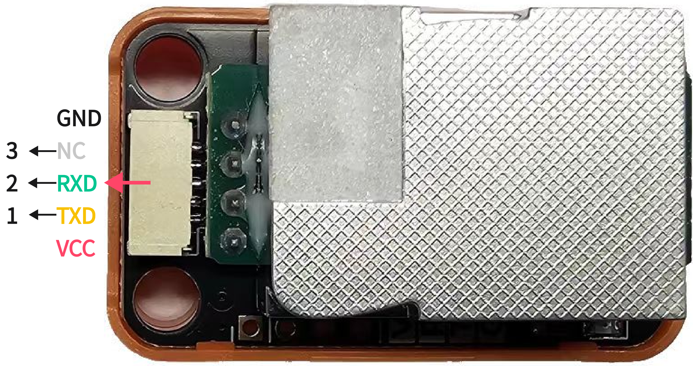
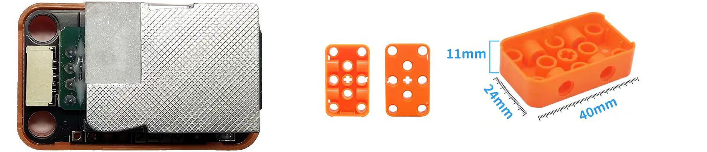
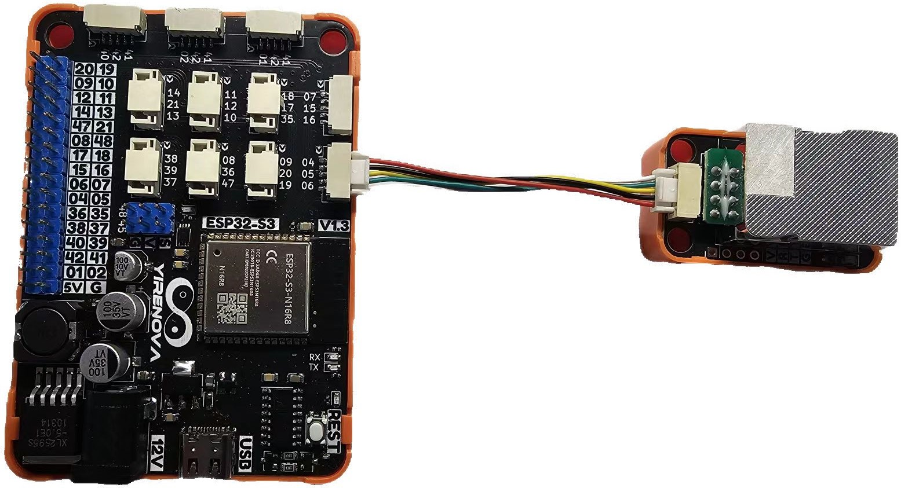
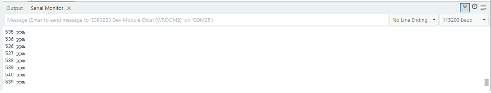

## ⭐ 简介
MH-Z19D 二氧化碳气体传感器是一个通用小型传感器，利用非色散红外（NDIR）原理对空气中存在的 CO2 进行探测，具有很好的选择性、无氧气依赖性、寿命长等特点。该传感器是将成熟的红外吸收气体检测技术与精密光路设计、精良电路设计紧密结合而制作出的高性能传感器。

<AccordionGroup>
<Accordion title="参数 & 接口 & 尺寸">

#### ⭐ 参数
- 工作温度：0~50℃
- 工作湿度：0~95%(无凝结)
- 工作电压：5V±0.1V
- 平均电流：< 40mA
- 峰值电流：125mA
- 测量范围：400~10000ppm
- 预热时间：1min
- 响应时间：T90 < 120s

#### ⭐ 接口


#### ⭐ 尺寸


</Accordion>
</AccordionGroup>


## ⭐ 如何使用
<AccordionGroup>
<Accordion title="准备 & 硬件连接">
在Artikit-ESP32-S3主控板控制下，使用串口通过CO2传感器采集CO2浓度的过程。

#### ⭐ 准备
- 硬件
    - Artikit-ESP32-S3主控板 x1
    - Artikit-CO2模组 x1
    - GH1.25连接线 x1
    - 12V直流电源 x1
    - PC电脑 x1
- 软件
[](https://arduino.cc/en/Main/Software)

#### ⭐ 连接图

</Accordion>

<Accordion title="例程代码">

打开Arduino的程序编译环境，上传以下代码：
```c++ read_co2.ino
#define UART1_TX_PIN    5
#define UART1_RX_PIN    6
#define DATA_BUFF_LEN   9

byte query_co2[9]={0xff, 0x01, 0x86, 0x00, 0x00, 0x00, 0x00, 0x00, 0x79};   // Query Data
              //  {0xff, 0x01, 0x87, 0x00, 0x00, 0x00, 0x00, 0x00, 0x78};   // Zero Calibration     Calibration can only be performed after stabilizing for 5 minutes in a 400 ppm environment.
              //  {0xff, 0x01, 0x87, 0x00, 0x00, 0x00, 0x00, 0x00, 0x78};   // Span Calibration     Select 2000 ppm environment (span calibration needs to be performed first)
int concentration_co2 = 0;

void setup() 
{
  Serial.begin(115200);
  Serial1.begin(9600, SERIAL_8N1, UART1_RX_PIN, UART1_TX_PIN); // UART1
}

void loop() 
{
  byte receivedData[DATA_BUFF_LEN] = {0};
  Serial1.write(query_co2, DATA_BUFF_LEN);
  delay(10);

  if (Serial1.available())
  {
    // Read the number of available bytes
    int  numBytes = Serial1.available();
    // Read bytes one by one and store them into a byte array
    Serial1.read(receivedData, numBytes);
    concentration_co2 = receivedData[2]*256 + receivedData[3];
  }

  Serial.print(concentration_co2);
  Serial.println(" ppm");
  delay(1000);
}
```
</Accordion>

<Accordion title="运行结果">
在Arduino IDE串口监视器可以查看到当前CO2浓度情况。

</Accordion>
</AccordionGroup>


## ⭐ 其他资料
<AccordionGroup>
<Accordion title="硬件原理图">
二氧化碳传感器模块原理图 [<Badge color="blue" size="lg">下载</Badge>](../../public/resources/schematics/co2.pdf)
</Accordion>

<Accordion title="数据手册">
二氧化碳传感器模块数据手册 [<Badge color="blue" size="lg">下载</Badge>](../../public/resources/datasheet/MH-Z19D.pdf)
</Accordion>

</AccordionGroup>
