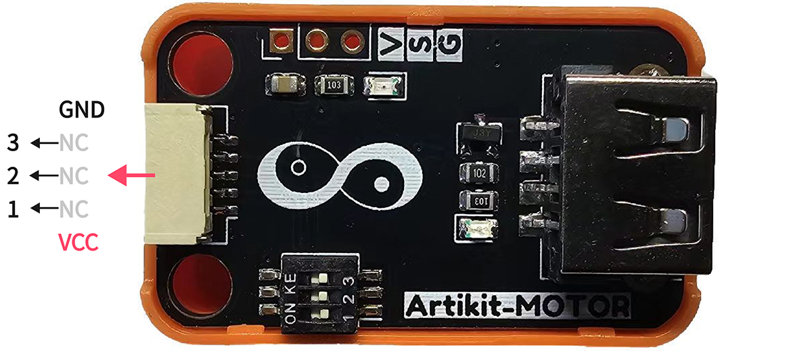
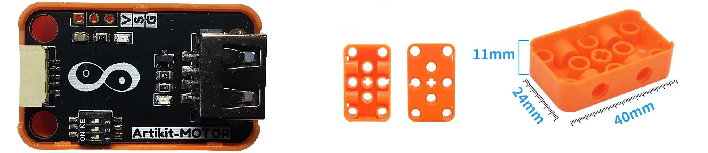
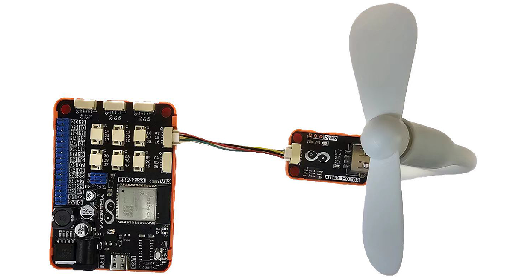
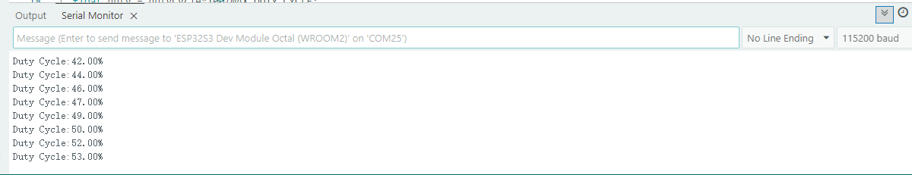

## ⭐ 简介
电机驱动模块使用N MOSFET控制电机的转动情况，通过USB接口可接入USB风扇、USB水泵、USB灯以及USB氧泵等等，要驱动的设备只要是Type-A形接口，供电符合标准USB，在功率不超过的情况下都可以用其进行驱动（仅限可PWM控制的设备）。

<AccordionGroup>
<Accordion title="参数 & 接口 & 尺寸">

#### ⭐ 参数
- 漏源电压：30V
- 连续漏极电流：5.8A
- 耗散功率：1.4W
- 阈值电压：1.45V@250uA
- 类型：N沟道 MOSFET

#### ⭐ 接口


#### ⭐ 尺寸
- 📐 24mm x 40mm x 17mm


</Accordion>
</AccordionGroup>


## ⭐ 如何使用
<AccordionGroup>
<Accordion title="准备 & 硬件连接">
在Artikit-ESP32-S3主控板控制下，控制USB风扇的转动。

#### ⭐ 准备
- 硬件
    - Artikit-ESP32-S3主控板 x1
    - Artikit-MOTOR模组 x1
    - USB风扇 x1
    - GH1.25连接线 x1
    - 12V直流电源 x1
    - PC电脑 x1
- 软件
[](https://arduino.cc/en/Main/Software)

#### ⭐ 连接图

</Accordion>

<Accordion title="例程代码">

- 需要将Artikit-MOTOR模组的拨码开关1，调整至ON。
- 将USB风扇连接到Artikit-MOTOR模组的USB座子上。
- 打开Arduino的程序编译环境，上传以下代码：
```c++ motor.ino
#define MOTOR_PIN   7

#define PWM_FREQ        500000  // 设置频率
#define PWM_RESOLUTION  6       // 计数位数，取值0 ~ 20
#define MAX_DUTY_CYCLE  63      // 2^10 - 1, if PWM resolution is 6, then it is 2^6 - 1 = 63
#define DUTY_COUNT      1

int dutyCycle = 0;
bool duty_flag = true; 

void setup() 
{
  Serial.begin(115200);
  ledcAttach(MOTOR_PIN, PWM_FREQ, PWM_RESOLUTION);
}
void loop() 
{
  float duty = dutyCycle*100/MAX_DUTY_CYCLE;
  Serial.print("Duty Cycle:");
  Serial.print(duty);
  Serial.println("%");

  if(dutyCycle == 0)
  {
    duty_flag = true;
  }
  if(dutyCycle == MAX_DUTY_CYCLE)
  {
    duty_flag = false;
  }

  if (duty_flag == true)
  {
    dutyCycle = dutyCycle + DUTY_COUNT;
  }else
  {
    dutyCycle = dutyCycle - DUTY_COUNT;
  }
 
  ledcWrite(MOTOR_PIN, dutyCycle);
  delay(100);
}
```
</Accordion>

<Accordion title="运行结果">
可以看到风扇慢慢转起来又慢慢停下去，也能看到蓝色指示灯呈现呼吸状态，在串口监视器中可查看当前PWM的占空比情况。


<iframe
  className="w-full aspect-video rounded-xl"
  src="../../images/motor/motor.mp4"
  title="视频播放器"
  allow="accelerometer; autoplay; clipboard-write; encrypted-media; gyroscope; picture-in-picture"
  allowFullScreen
></iframe>
</Accordion>
</AccordionGroup>


## ⭐ 其他资料
<AccordionGroup>
<Accordion title="硬件原理图">
电机驱动模块原理图 [<Badge color="blue" size="lg">下载</Badge>](../../public/resources/schematics/rly.pdf)
</Accordion>

<Accordion title="数据手册">
所用MOSFET数据手册 [<Badge color="blue" size="lg">下载</Badge>](../../public/resources/datasheet/AO3400.PDF)
</Accordion>

</AccordionGroup>
