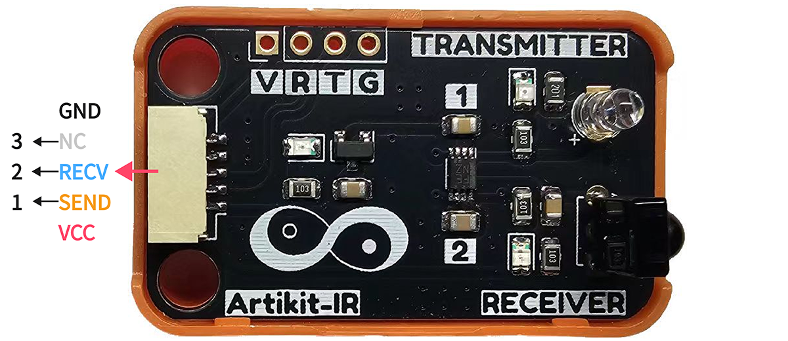
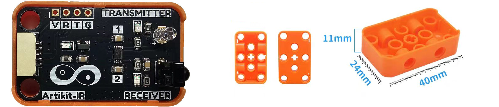
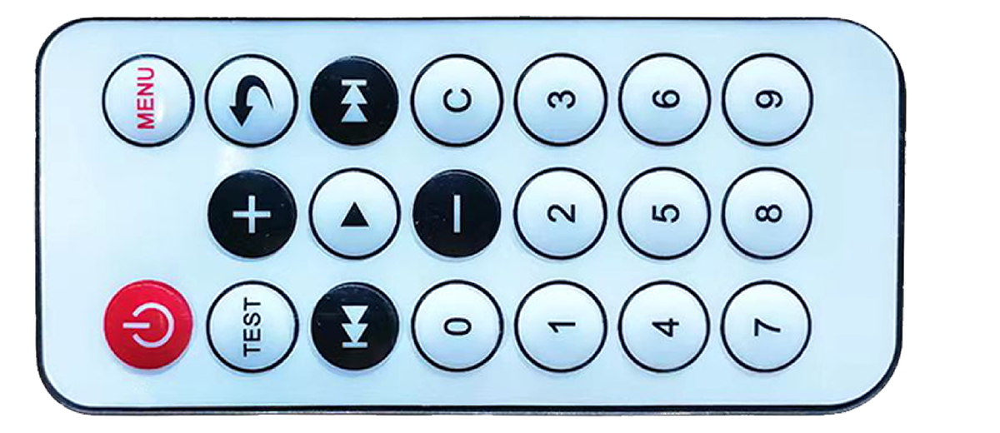
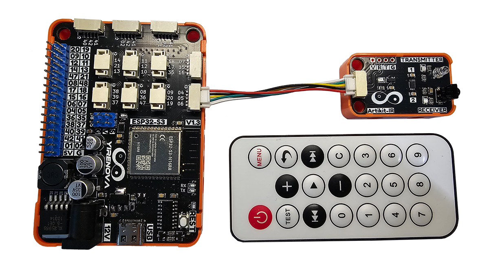
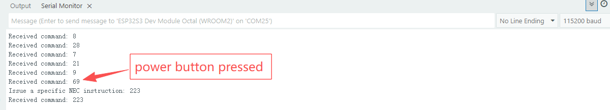

## ⭐ 简介

**📥 接收端**

HX1838是一款广泛应用于红外遥控领域的红外接收模块，属于一体化红外接收器。该模块由一个红外光电二极管、前置放大器和解调电路组成，能够接收并解调红外遥控器发射的38kHz载波信号。它具有高灵敏度、低功耗、抗干扰能力强等优点，适用于各类家用电器、智能控制系统和工业设备中的红外遥控接收部分。

**📤 发送端**

IR940 红外LED 是一款低功耗，插件式外型封装的二极管，它具有发射功率强、受光角度均匀等优点。

**🗄️ 遥控器**

遥控器通过NEC协议的方式发送特定的红外光波，NEC协议通过发射特定的38Khz载波，采用脉冲形式进行编码与设备通讯，达到控制设备的目的。

<AccordionGroup>
<Accordion title="参数 & 接口 & 尺寸">

#### ⭐ 参数

- 📥接收端参数
    - 工作温度：-20 ~ 85℃
    - 工作电压：2.7V ~ 5.5V
    - 工作电流：0.8mA
    - 接收角度：±45°
    - 响应时间：≈1ms
- 📤接收端
    - 工作温度：-40 ~ 85℃
    - 工作电压：5V
    - 工作电流：100mA
    - 发射视角：32°
    - 发射波长：940nm
- 🗄️ 遥控器
    - 发射距离：Max 8m
    - 发射频率：38Khz
    - 按键数量：20键
    - 编码：NEC格式, udp6122方案


#### ⭐ 接口


#### ⭐ 模块尺寸
- 📐 24mm x 40mm x 20.5mm



#### ⭐ 遥控器尺寸
- 📐 86mm x 40mm x 6mm



</Accordion>
</AccordionGroup>


## ⭐ 如何使用
<AccordionGroup>
<Accordion title="准备 & 硬件连接">
在Artikit-ESP32-S3主控板控制下，通过ir接收端接收遥控器发射的信号，并解析打印在串口监视器中。随后通过ir发射端发送一组确定的指令，再次通过接收端接收自身发射的信号，并且打印在串口监视器中。

#### ⭐ 准备
- 硬件
    - Artikit-ESP32-S3主控板 x1
    - Artikit-IR模组 x1
    - 红外遥控器 x1
    - GH1.25连接线 x1
    - 12V直流电源 x1
    - PC电脑 x1
- 软件
[](https://arduino.cc/en/Main/Software)
    - 需要安装 IRremote 库
#### ⭐ 连接图

</Accordion>

<Accordion title="例程代码">

- 打开Arduino的程序编译环境，上传以下代码：
```c++ ir.ino
#include <IRremote.h>

#define IR_SEND_PIN     4
#define IR_RECV_PIN     5
#define SENDING_REPEATS 1     // 信号发送次数

void setup() 
{
  Serial.begin(115200); // 初始化串口
  IrReceiver.begin(IR_RECV_PIN, DISABLE_LED_FEEDBACK);
  IrSender.begin(IR_SEND_PIN, ENABLE_LED_FEEDBACK);
}
void loop() 
{ 

  if (IrReceiver.decode())
  {
    Serial.print("Received command: ");
    Serial.println(IrReceiver.decodedIRData.command);
    IrReceiver.resume();

    delay(2000);
    if(IrReceiver.decodedIRData.command == 69)    // Remote control power button pressed
    {
      unsigned long code = 0x20DF10EF;     // command == 223
      Serial.println("Issue a specific NEC instruction: 223");
      IrSender.sendNECRaw(code, SENDING_REPEATS);
    }
  }
  delay(100);
}
```
</Accordion>

<Accordion title="运行结果">
在Arduino IDE串口监视器可以查看到NEC红外遥控指令解析的情况，当按键为电源键时，设备通过IR发射指令为223红外指令信号。

</Accordion>
</AccordionGroup>


## ⭐ 其他资料
<AccordionGroup>
<Accordion title="硬件原理图">
人体红外传感器模块原理图 [<Badge color="blue" size="lg">下载</Badge>](../../public/resources/schematics/ir.pdf)
</Accordion>

<Accordion title="数据手册">

**红外接收**传感器数据手册 [<Badge color="blue" size="lg">下载</Badge>](../../public/resources/datasheet/HX1813.pdf)

**红外发送**传感器数据手册 [<Badge color="blue" size="lg">下载</Badge>](../../public/resources/datasheet/IR940.pdf)
</Accordion>

</AccordionGroup>
