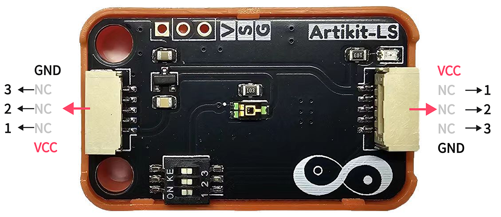
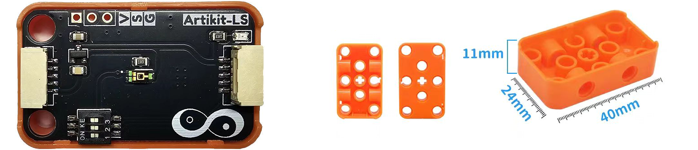
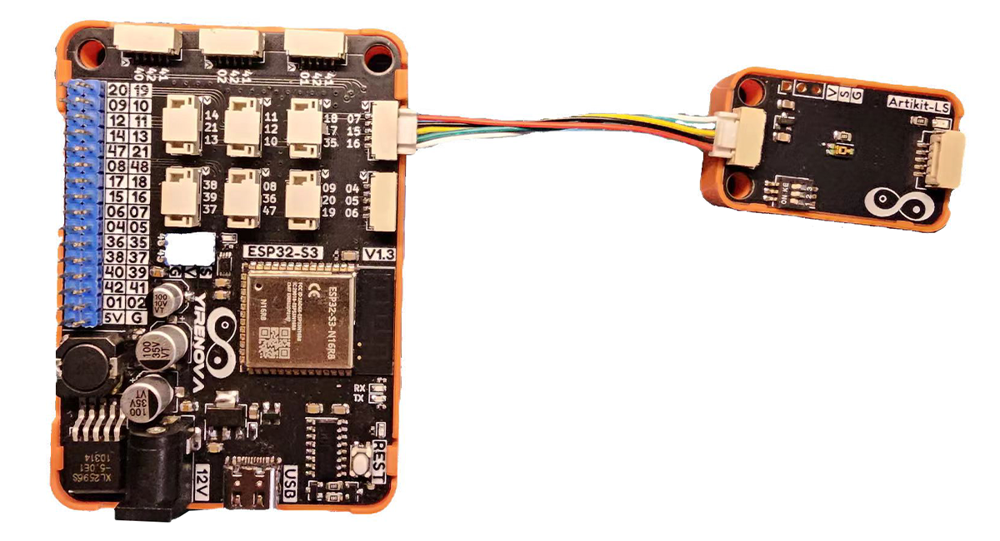
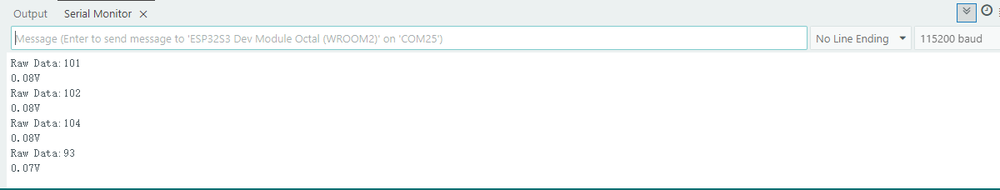

## ⭐ 简介
TEMT6000X01环境光传感器是一款采用微型透明1206表贴封装的硅NPN外延平面光电晶体管。它对可见光的敏感度与人眼相近，在570nm处具有峰值灵敏度。

<AccordionGroup>
<Accordion title="参数 & 接口 & 尺寸">

#### ⭐ 参数
- 工作温度：-40 ~ 100℃
- 工作电压：3.3 ~ 5V
- 照度范围：1 ~ 1000Lux
- 输出信号： 模拟电压，在3.3V工作电压情况范围 0 ~ 3.3V

#### ⭐ 接口


#### ⭐ 尺寸
- 📐 24mm x 40mm x 14.6mm



</Accordion>
</AccordionGroup>


## ⭐ 如何使用
<AccordionGroup>
<Accordion title="准备 & 硬件连接">
在Artikit-ESP32-S3主控板控制下，通过人体传感器感知有人状态。

#### ⭐ 准备
- 硬件
    - Artikit-ESP32-S3主控板 x1
    - Artikit-LS模组 x1
    - GH1.25连接线 x1
    - 12V直流电源 x1
    - PC电脑 x1
- 软件
[](https://arduino.cc/en/Main/Software)

#### ⭐ 连接图

</Accordion>

<Accordion title="例程代码">

- 需要将Artikit-LS模组的拨码开关1，调整至ON。

- 打开Arduino的程序编译环境，上传以下代码：
```c++ lightsensor.ino
#define TEMT6000_ADC_PIN  7

void setup() 
{
  pinMode(TEMT6000_ADC_PIN, INPUT);
  Serial.begin(115200);
}
void loop() 
{
  int lightValue = analogRead(TEMT6000_ADC_PIN);
  Serial.print("Raw Data:");
  Serial.println(lightValue);

  float val = ((float)lightValue/4096)*3.3; 
  Serial.print(val);
  Serial.println("V");

  delay(1000);
}
```
</Accordion>

<Accordion title="运行结果">
在Arduino IDE串口监视器可以查看到当前光照强度情况。

</Accordion>
</AccordionGroup>


## ⭐ 其他资料
<AccordionGroup>
<Accordion title="硬件原理图">
光照强度传感器模块原理图 [<Badge color="blue" size="lg">下载</Badge>](../../public/resources/schematics/ls.pdf)
</Accordion>

<Accordion title="数据手册">
光照强度传感器模块数据手册 [<Badge color="blue" size="lg">下载</Badge>](../../public/resources/datasheet/TEMT6000.pdf)
</Accordion>

</AccordionGroup>
