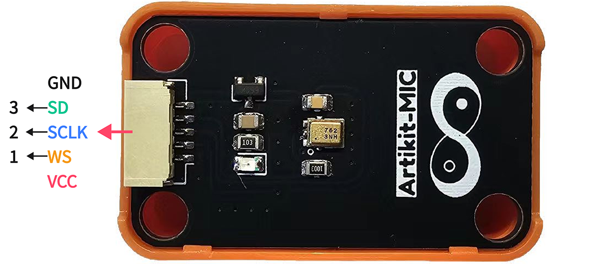
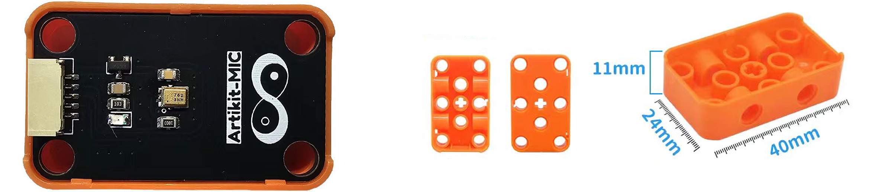
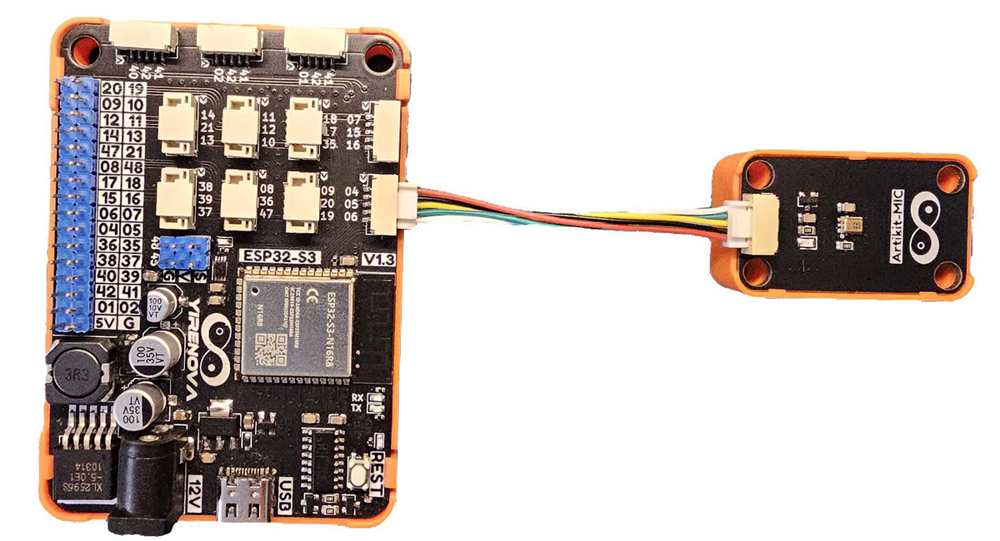

## ⭐ 简介
ICS-43434是一款数字I2S输出底部端口麦克风。完整的ICS-43434解决方案包括MEMS传感器、信号调理、模数转换器、抽取和抗混叠滤波器、电源管理IC以及行业标准的24位I2S接口。I2S接口允许ICS-43434直接连接到数字处理器，如DSP和微控制器，而无需系统中的音频编解码器。

<AccordionGroup>
<Accordion title="参数 & 接口 & 尺寸">

#### ⭐ 参数
- 工作电压：1.65 ~ 3.63V
- 工作电流：550uA
- 指向性：全指向
- 信噪比：64dB

#### ⭐ 接口


#### ⭐ 尺寸
- 📐 24mm x 40mm x 14.6mm


</Accordion>
</AccordionGroup>


## ⭐ 如何使用
<AccordionGroup>
<Accordion title="准备 & 硬件连接">
在Artikit-ESP32-S3主控板控制下，通过麦克风模组获取外界声音。

#### ⭐ 准备
- 硬件
    - Artikit-ESP32-S3主控板 x1
    - Artikit-MIC模组 x1
    - GH1.25连接线 x1
    - 12V直流电源 x1
    - PC电脑 x1
- 软件
[](https://arduino.cc/en/Main/Software)

#### ⭐ 连接图

</Accordion>

<Accordion title="例程代码">

- 打开Arduino的程序编译环境，上传以下代码：
```c++ mic.ino
// 等待补充
/*
*
*/
```
</Accordion>

<Accordion title="运行结果">
等待内容的 补充


<iframe
  className="w-full aspect-video rounded-xl"
  src="../../images/mic/mic.mp4"
  title="视频播放器"
  allow="accelerometer; autoplay; clipboard-write; encrypted-media; gyroscope; picture-in-picture"
  allowFullScreen
></iframe>

</Accordion>
</AccordionGroup>


## ⭐ 其他资料
<AccordionGroup>
<Accordion title="硬件原理图">
麦克风模块原理图 [<Badge color="blue" size="lg">下载</Badge>](../../public/resources/schematics/mic.pdf)
</Accordion>

<Accordion title="数据手册">
麦克风模块芯片数据手册 [<Badge color="blue" size="lg">下载</Badge>](../../public/resources/datasheet/ICS-43434.PDF)
</Accordion>

</AccordionGroup>
