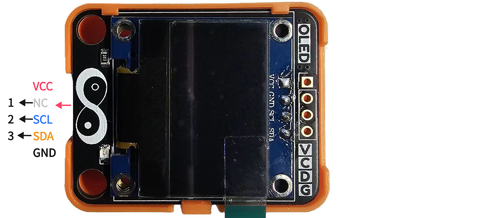
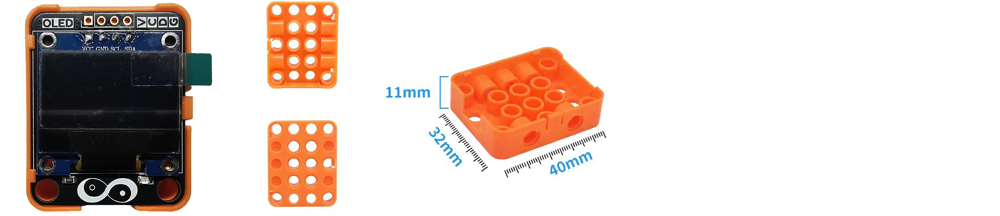
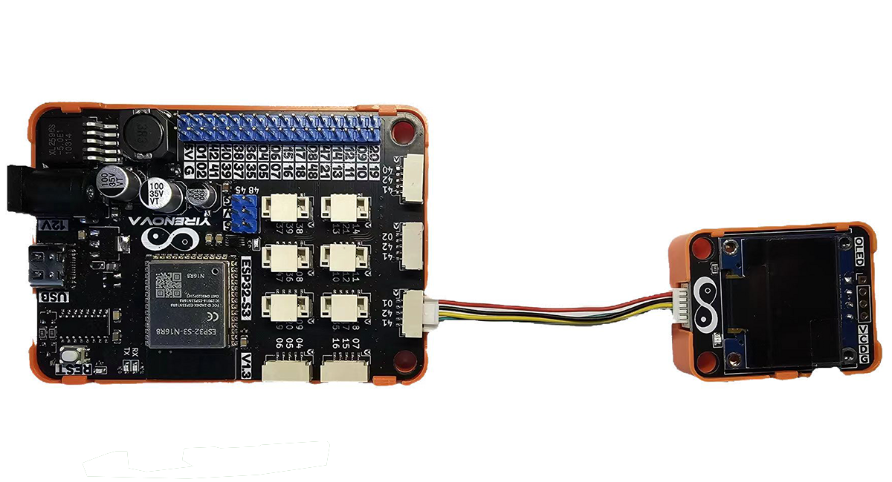
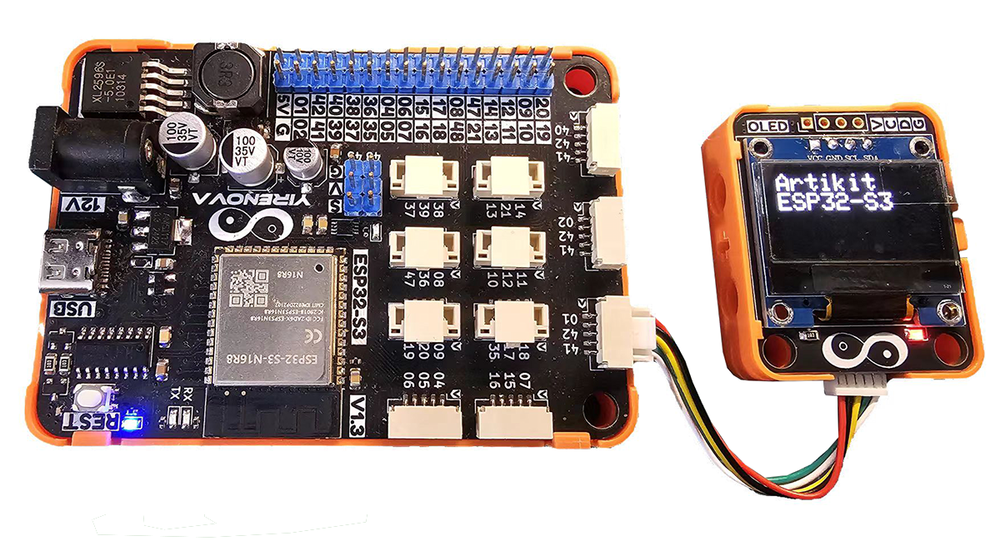

## ⭐ 简介
SSD1306是一个单片CMOS OLED/PLED 驱动芯片可以驱动有机/聚合发光二极管点阵图形显示系统。由128segments和64Commons组成。该芯片专为共阴极OLED面板设计。 SSD1306中嵌入了对比度控制器、显示RAM和晶振，并因此减少了外部器件和功耗。有256级亮度控制。数据/命令的发送有两种接口可选择：I2C接口或SPI接口。 适用于多数简介的应用，注入移动电话的屏显，MP3播放器和计算器等。

<AccordionGroup>
<Accordion title="参数 & 接口 & 尺寸">

#### ⭐ 参数
- 工作温度：-40 ~ 70℃
- 工作电压：3.3 ~ 5V
- 显示像素：128 x 64
- 驱动芯片：SSD1306
- 显示颜色：白色
- 尺寸：0.96 inch

#### ⭐ 接口


#### ⭐ 尺寸
- 📐 32mm x 40mm x 14.6mm


</Accordion>
</AccordionGroup>


## ⭐ 如何使用
<AccordionGroup>
<Accordion title="准备 & 硬件连接">
在Artikit-ESP32-S3主控板控制下，通过OLED显示屏显示文字信息。

#### ⭐ 准备
- 硬件
    - Artikit-ESP32-S3主控板 x1
    - Artikit-OLED模组 x1
    - GH1.25连接线 x1
    - 12V直流电源 x1
    - PC电脑 x1
- 软件
[](https://arduino.cc/en/Main/Software)

#### ⭐ 连接图

</Accordion>

<Accordion title="例程代码">

- 打开Arduino的程序编译环境，上传以下代码：
```c++ oled.ino
#include <Wire.h>
#include <Adafruit_GFX.h>
#include <Adafruit_SSD1306.h>

#define IIC_SDA_PIN 41
#define IIC_SCL_PIN 42

#define SCREEN_WIDTH 128
#define SCREEN_HEIGHT 64

#define OLED_RESET -1
#define SCREEN_ADDRESS 0x3C

Adafruit_SSD1306 display(SCREEN_WIDTH, SCREEN_HEIGHT, &Wire, OLED_RESET);

void setup() {
  Wire.begin(IIC_SDA_PIN, IIC_SCL_PIN);

  if (!display.begin(SSD1306_SWITCHCAPVCC, SCREEN_ADDRESS)) {
    Serial.println(F("SSD1306 allocation failed"));
    for (;;);
  }
  display.clearDisplay();
  display.setTextSize(2);
  display.setTextColor(SSD1306_WHITE);
  display.setCursor(0, 0);
  display.println("Artikit");
  display.println("ESP32-S3");
  display.display();
}
void loop() 
{

}
```
</Accordion>

<Accordion title="运行结果">
将会在OLED显示屏上看到显示的 “Artikit ESP32-S3” 信息。

</Accordion>
</AccordionGroup>


## ⭐ 其他资料
<AccordionGroup>
<Accordion title="硬件原理图">
OLED显示模块原理图 [<Badge color="blue" size="lg">下载</Badge>](../../public/resources/schematics/oled.pdf)
</Accordion>

<Accordion title="数据手册">
OLED显示驱动芯片数据手册 [<Badge color="blue" size="lg">下载</Badge>](../../public/resources/datasheet/SSD1306.PDF)

OLED显示屏数据手册 [<Badge color="blue" size="lg">下载</Badge>](../../public/resources/datasheet/N096-2864KSWEG01-H30.PDF)
</Accordion>

</AccordionGroup>
