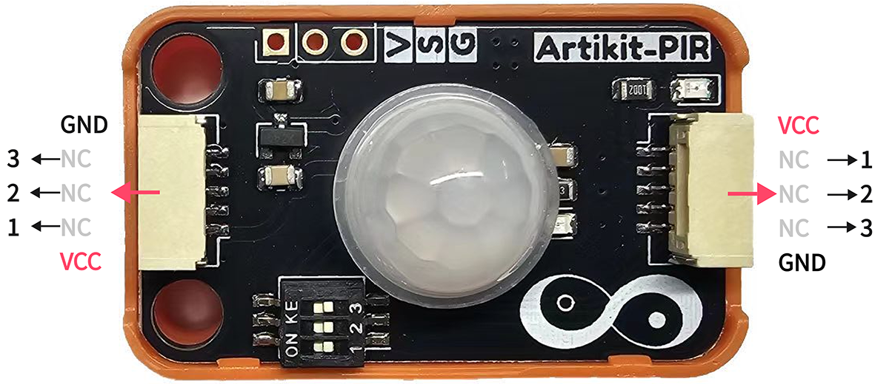
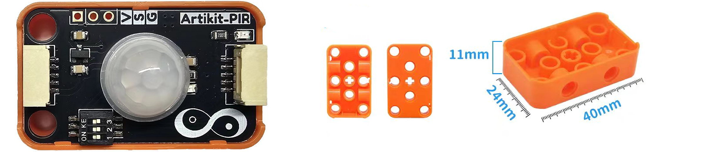
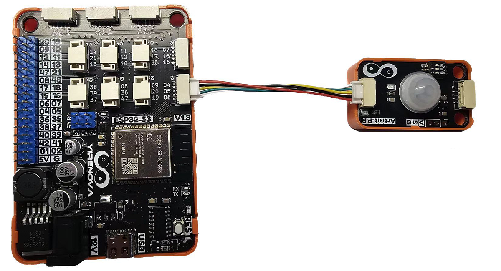
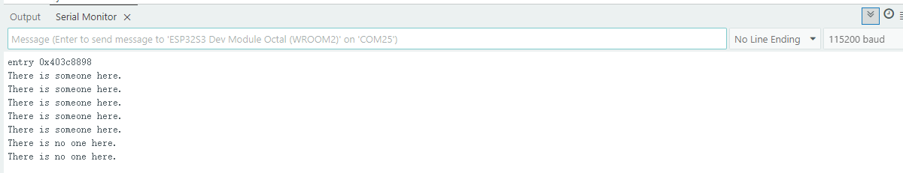

## ⭐ 简介
AS312是将数字智能控制电路与人体探测敏感元都集成在电磁屏蔽罩内的热释电红外传感器。

<AccordionGroup>
<Accordion title="参数 & 接口 & 尺寸">

#### ⭐ 参数
- 工作温度：-20 ~ 85℃
- 工作电压：3.3V
- 平均电流：15mA
- 输出延迟时间：2.3s

#### ⭐ 接口


#### ⭐ 尺寸
- 📐 24mm x 40mm x 20.8mm



</Accordion>
</AccordionGroup>


## ⭐ 如何使用
<AccordionGroup>
<Accordion title="准备 & 硬件连接">
在Artikit-ESP32-S3主控板控制下，通过人体传感器感知有人状态。

#### ⭐ 准备
- 硬件
    - Artikit-ESP32-S3主控板 x1
    - Artikit-PIR模组 x1
    - GH1.25连接线 x1
    - 12V直流电源 x1
    - PC电脑 x1
- 软件
[](https://arduino.cc/en/Main/Software)

#### ⭐ 连接图

</Accordion>

<Accordion title="例程代码">

- 需要将Artikit-PIR模组的拨码开关1，调整至ON。

- 打开Arduino的程序编译环境，上传以下代码：
```c++ pir.ino
#define PIR_PIN     4

void setup() 
{
  pinMode(PIR_PIN, INPUT);
  Serial.begin(115200);
}
void loop() 
{
  if(digitalRead(PIR_PIN) == HIGH)
  {
    Serial.println("There is someone here.");
  }else
  {
    Serial.println("There is no one here.");
  }
}
```
</Accordion>

<Accordion title="运行结果">
在Arduino IDE串口监视器可以查看到当前CO2浓度情况。

</Accordion>
</AccordionGroup>


## ⭐ 其他资料
<AccordionGroup>
<Accordion title="硬件原理图">
人体红外传感器模块原理图 [<Badge color="blue" size="lg">下载</Badge>](../../public/resources/schematics/pir.pdf)
</Accordion>

<Accordion title="数据手册">
人体红外传感器模块数据手册 [<Badge color="blue" size="lg">下载</Badge>](../../public/resources/datasheet/AS-312.pdf)
</Accordion>

</AccordionGroup>
