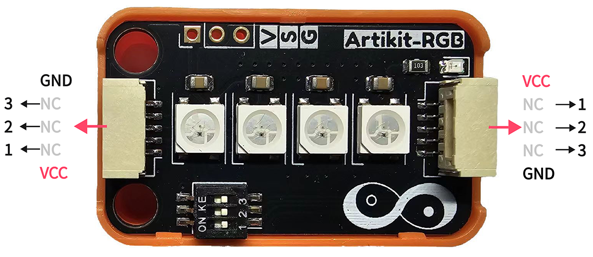
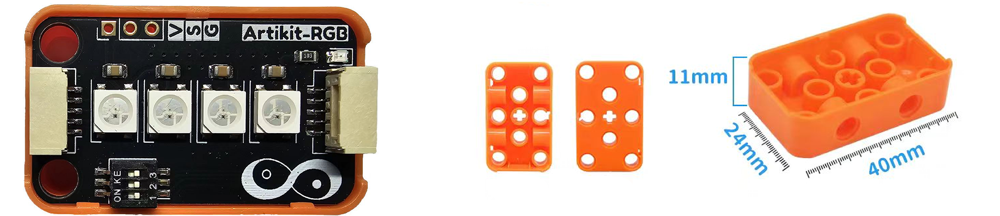

## ⭐ 简介
WS2812是一种可编程的LED灯，具有RGB显示效果，可显示的颜色数量为2^24。

<AccordionGroup>
<Accordion title="参数 & 接口 & 尺寸">

#### ⭐ 参数
- 工作温度：-40 ~ 65℃
- 工作电压：3.7 ~ 5.3V
- 工作电流：0.6mA
- PWM频率：2Khz
- 数据速率：800Kbit/s

#### ⭐ 接口


#### ⭐ 尺寸
- 📐 24mm x 40mm x 14.6mm


</Accordion>
</AccordionGroup>


## ⭐ 如何使用
<AccordionGroup>
<Accordion title="准备 & 硬件连接">
在Artikit-ESP32-S3主控板控制下，控制RGB彩灯的闪烁。

#### ⭐ 准备
- 硬件
    - Artikit-ESP32-S3主控板 x1
    - Artikit-RGB模组 x1
    - GH1.25连接线 x1
    - 12V直流电源 x1
    - PC电脑 x1
- 软件
[](https://arduino.cc/en/Main/Software)
    - 需要安装FastLED库

#### ⭐ 连接图

</Accordion>

<Accordion title="例程代码">

- 需要将Artikit-RGB模组的拨码开关1，调整至ON。

- 打开Arduino的程序编译环境，上传以下代码：
```c++ lightsensor.ino
#include <FastLED.h>

#define DATA_PIN 7
#define NUM_LEDS 4
CRGB leds[NUM_LEDS];
uint8_t max_bright = 128;
void setup() 
{
  FastLED.addLeds<WS2812, DATA_PIN, GRB>(leds, NUM_LEDS);
  FastLED.setBrightness(max_bright);
}

void loop() {
  for (int i = 0; i < NUM_LEDS; i++) {
    leds[i] = CRGB::Red;
    FastLED.show();
    delay(500);
    leds[i] = CRGB::Black;
  }
}
```
</Accordion>

<Accordion title="运行结果">
在Arduino IDE串口监视器可以查看到当前光照强度情况。
<iframe
  className="w-full aspect-video rounded-xl"
  src="../../images/rgb/rgb.mp4"
  title="YouTube 视频播放器"
  allow="accelerometer; autoplay; clipboard-write; encrypted-media; gyroscope; picture-in-picture"
  allowFullScreen
></iframe>
</Accordion>
</AccordionGroup>


## ⭐ 其他资料
<AccordionGroup>
<Accordion title="硬件原理图">
三色彩灯模块原理图 [<Badge color="blue" size="lg">下载</Badge>](../../public/resources/schematics/rgb.pdf)
</Accordion>

<Accordion title="数据手册">
三色彩灯模块数据手册 [<Badge color="blue" size="lg">下载</Badge>](../../public/resources/datasheet/WS2812B-V5-W.pdf)
</Accordion>

</AccordionGroup>
