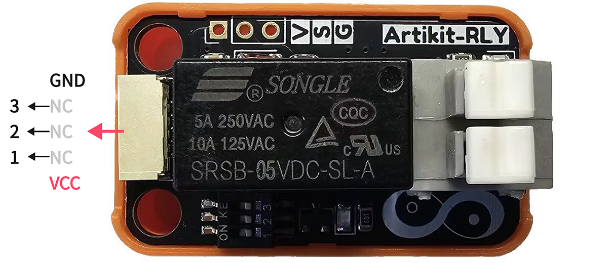
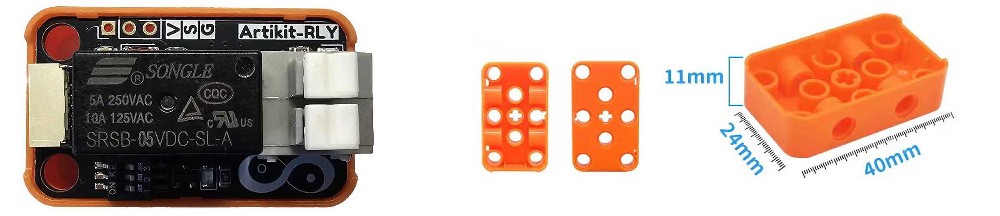
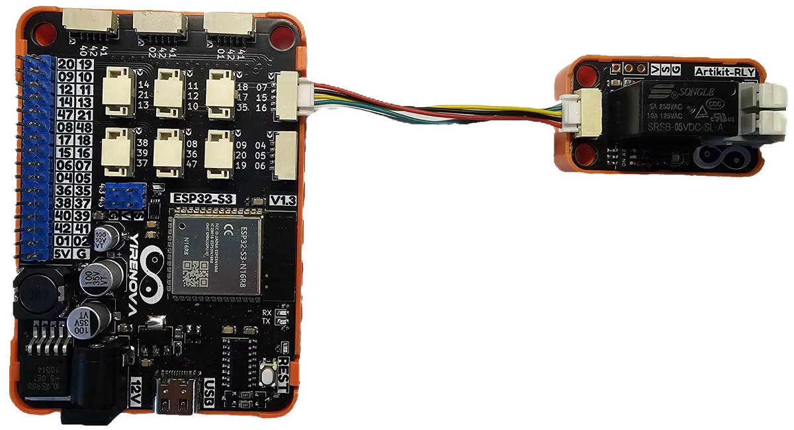

## ⭐ 简介
SRSB-05VDC-SL-A是松乐(SONGLE)直流继电器，它的线圈电压是5VDC。在250VAC情况下触点可通过最大5A工作电流，在125VAC情况下触点可通过最大10A工作电流。

<AccordionGroup>
<Accordion title="参数 & 接口 & 尺寸">

#### ⭐ 参数
- 工作温度：-40 ~ 85℃
- 工作湿度：5 ~ 85%RH
- 工作电压：5V
- 导通电流：Max 250VAC 5A   MAX 125VAC 10A
- 吸合时间(额定电压下)：≤8ms
- 释放时间(额定电压下)：≤5ms

#### ⭐ 接口


#### ⭐ 尺寸
- 📐 24mm x 40mm x 26mm


</Accordion>
</AccordionGroup>


## ⭐ 如何使用
<AccordionGroup>
<Accordion title="准备 & 硬件连接">
在Artikit-ESP32-S3主控板控制下，控制有继电器的打开和闭合。

#### ⭐ 准备
- 硬件
    - Artikit-ESP32-S3主控板 x1
    - Artikit-RLY模组 x1
    - GH1.25连接线 x1
    - 12V直流电源 x1
    - PC电脑 x1
- 软件
[](https://arduino.cc/en/Main/Software)

#### ⭐ 连接图

</Accordion>

<Accordion title="例程代码">

- 需要将Artikit-RLY模组的拨码开关1，调整至ON。

- 打开Arduino的程序编译环境，上传以下代码：
```c++ relay.ino
#define RELAY_PIN  7

void setup() {
  pinMode(RELAY_PIN, OUTPUT);
}
void loop() {
  digitalWrite(RELAY_PIN, HIGH);
  delay(1000);
  digitalWrite(RELAY_PIN, LOW);
  delay(1000);
}
```
</Accordion>

<Accordion title="运行结果">
可以听到继电器开合的声音，也能看到蓝色指示灯表示导通情况。
<iframe
  className="w-full aspect-video rounded-xl"
  src="../../images/rly/rly.mp4"
  title="视频播放器"
  allow="accelerometer; autoplay; clipboard-write; encrypted-media; gyroscope; picture-in-picture"
  allowFullScreen
></iframe>
</Accordion>
</AccordionGroup>


## ⭐ 其他资料
<AccordionGroup>
<Accordion title="硬件原理图">
继电器模块原理图 [<Badge color="blue" size="lg">下载</Badge>](../../public/resources/schematics/rly.pdf)
</Accordion>

<Accordion title="数据手册">
继电器模块数据手册 [<Badge color="blue" size="lg">下载</Badge>](../../public/resources/datasheet/SRSB-5VDC-SL-A.PDF)
</Accordion>

</AccordionGroup>
