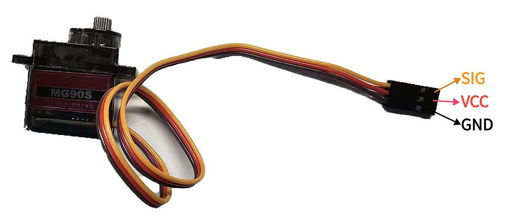
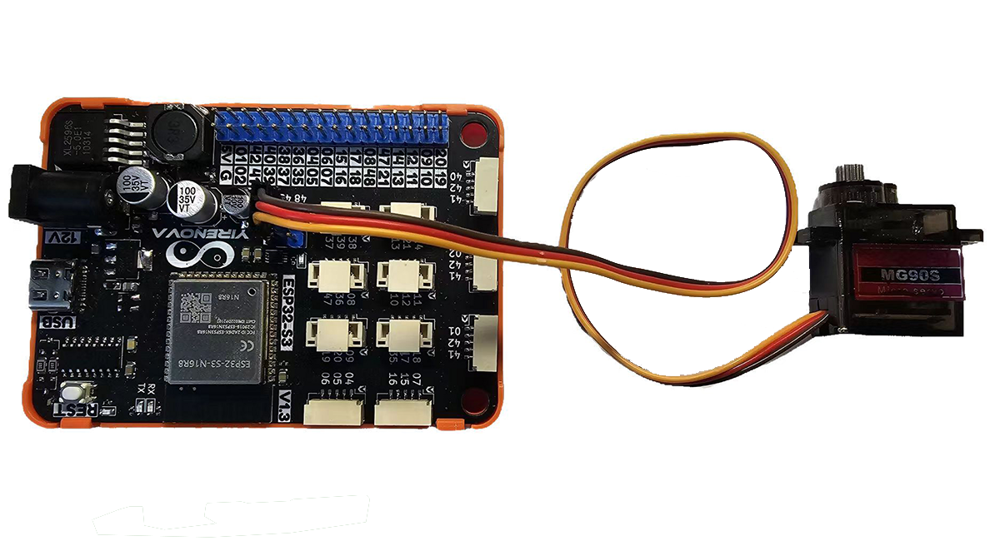

## ⭐ 简介
MG90S舵机是一种电动装置，常用于控制机械系统的转动角度和位置。它由电机、减速器、位置反馈器和控制电路组成。舵机通常通过接收控制信号来控制输出轴的转动角度和位置，并通过内部的位置反馈器和控制电路实现精确的控制。

<AccordionGroup>
<Accordion title="参数 & 接口 & 尺寸">

#### ⭐ 参数
- 工作温度：0 ~ 55℃
- 工作电压：3.3 ~ 5V
- 反应速度：0.11s(4.8V)
- 死区设定：5us
- 角度范围：360°

#### ⭐ 接口


#### ⭐ 尺寸
- 📐 24mm x 40mm x 14.6mm


</Accordion>
</AccordionGroup>


## ⭐ 如何使用
<AccordionGroup>
<Accordion title="准备 & 硬件连接">
在Artikit-ESP32-S3主控板控制下，控制舵机来回转动。

#### ⭐ 准备
- 硬件
    - Artikit-ESP32-S3主控板 x1
    - MG90S舵机 x1
    - GH1.25连接线 x1
    - 12V直流电源 x1
    - PC电脑 x1
- 软件
[](https://arduino.cc/en/Main/Software)
    - 需要安装ESP32Servo库

#### ⭐ 连接图

</Accordion>

<Accordion title="例程代码">

- 打开Arduino的程序编译环境，上传以下代码：
```c++ servo.ino
#include <ESP32Servo.h>

#define SERVO_PIN     45

Servo servo1; // 创建舵机对象
void setup() 
{
 servo1.setPeriodHertz(100);          // 设置PWM频率为50Hz
 servo1.attach(SERVO_PIN, 500, 2500); // 引脚，脉冲宽度范围500-2500微秒
 servo1.write(0);                     // 初始化舵机角度为90度
}
void loop() 
{
 for (int angle = 0; angle <= 180; angle++) {
   servo1.write(angle); // 设置舵机角度
   delay(10); // 延迟以确保舵机完成动作
 }
 delay(100);
 for (int angle = 180; angle >= 0; angle--) {
   servo1.write(angle);
   delay(10);
 }
 delay(100);
}
```
</Accordion>

<Accordion title="运行结果">
可以看到舵机在来回转动。
<iframe
  className="w-full aspect-video rounded-xl"
  src="../../images/servo/servo.mp4"
  title="视频播放器"
  allow="accelerometer; autoplay; clipboard-write; encrypted-media; gyroscope; picture-in-picture"
  allowFullScreen
></iframe>
</Accordion>
</AccordionGroup>


## ⭐ 其他资料
<AccordionGroup>
<Accordion title="数据手册">
舵机数据手册 [<Badge color="blue" size="lg">下载</Badge>](../../public/resources/datasheet/MG90S.PDF)
</Accordion>

</AccordionGroup>
