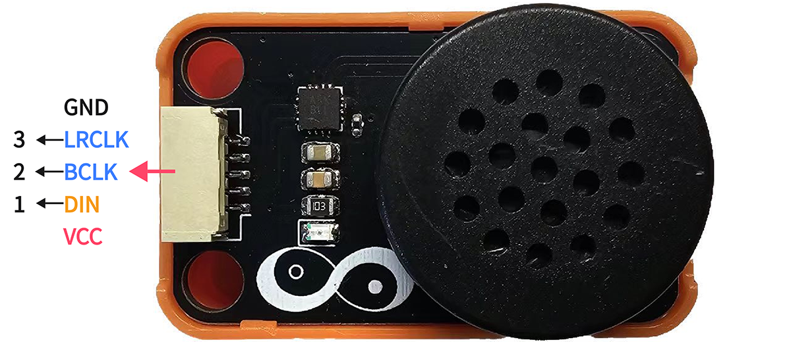
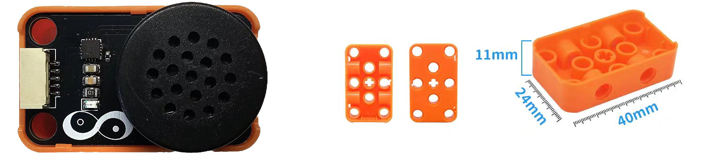
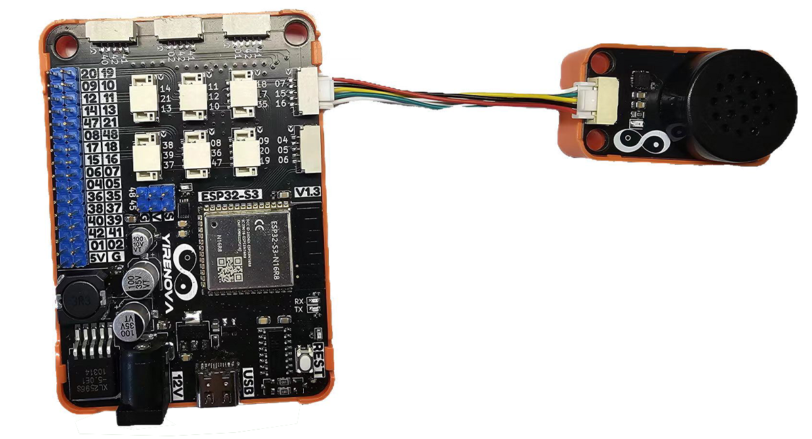

## ⭐ 简介
**🔈 驱动IC**

MAX98357AETE+T是一款易用、低成本的数字脉冲编码调制（PCM）输入D类放大器，具备AB类音频性能和D类效率。数字音频接口可自动识别多达35种不同的PCM和TDM时钟方案，无需编程。此外，它还无需通常用于PCM通信的外部MCLK信号，进一步简化了操作。只需提供电源、LRCLK、BCLK和数字音频信号，即可输出音频！此外，新颖的引脚排列使客户能够使用经济高效的WLP封装，无需昂贵的过孔。 MAX98357A支持I2S数据，MAX98357B支持左对齐数据，数字音频接口具有高度灵活性。

**🔊 喇叭**

SND2308是无源直插8Ω 1W脚距10m扬声器，经常用于玩具或者家用设备上的发声单元。

<AccordionGroup>
<Accordion title="参数 & 接口 & 尺寸">

#### ⭐ 参数
- 工作温度：-40 ~ 85℃
- 功放类型：D类功放
- 输出功率：3.2Wx1@4Ω
- 工作电压：2.5 ~ 5.5V
- 静态电流：2.4mA
- 电源纹波抑制比：77dB
- 效率：92%

#### ⭐ 接口


#### ⭐ 尺寸
- 📐 24mm x 40mm x 17mm


</Accordion>
</AccordionGroup>


## ⭐ 如何使用
<AccordionGroup>
<Accordion title="准备 & 硬件连接">
在Artikit-ESP32-S3主控板控制下，控制扬声器发出声音。

#### ⭐ 准备
- 硬件
    - Artikit-ESP32-S3主控板 x1
    - Artikit-SPEAKER模组 x1
    - GH1.25连接线 x1
    - 12V直流电源 x1
    - PC电脑 x1
- 软件
[](https://arduino.cc/en/Main/Software)

#### ⭐ 连接图

</Accordion>

<Accordion title="例程代码">

- 打开Arduino的程序编译环境，上传以下代码：
```c++ spk.ino
// 等待补充
/*
*
*/
```
</Accordion>

<Accordion title="运行结果">
等待内容的 补充


<iframe
  className="w-full aspect-video rounded-xl"
  src="../../images/spk/spk.mp4"
  title="视频播放器"
  allow="accelerometer; autoplay; clipboard-write; encrypted-media; gyroscope; picture-in-picture"
  allowFullScreen
></iframe>

</Accordion>
</AccordionGroup>


## ⭐ 其他资料
<AccordionGroup>
<Accordion title="硬件原理图">
扬声器模块原理图 [<Badge color="blue" size="lg">下载</Badge>](../../public/resources/schematics/spk.pdf)
</Accordion>

<Accordion title="数据手册">
扬声器驱动芯片数据手册 [<Badge color="blue" size="lg">下载</Badge>](../../public/resources/datasheet/MAX98357AETE+T.PDF)

扬声器数据手册 [<Badge color="blue" size="lg">下载</Badge>](../../public/resources/datasheet/SND2308.PDF)
</Accordion>

</AccordionGroup>
