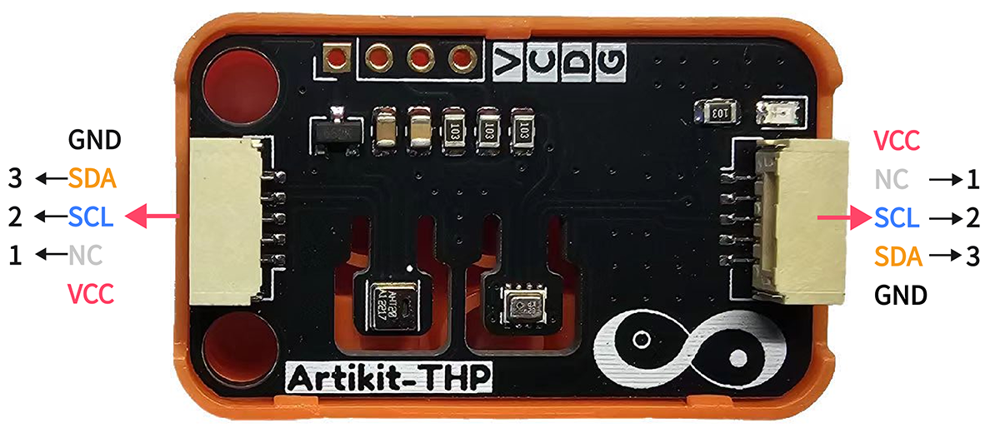
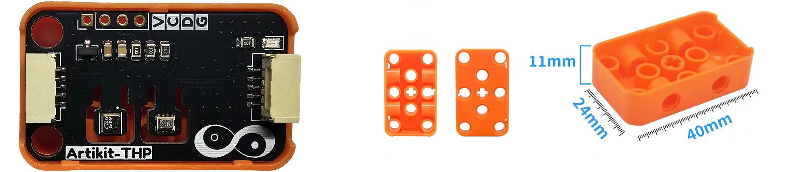
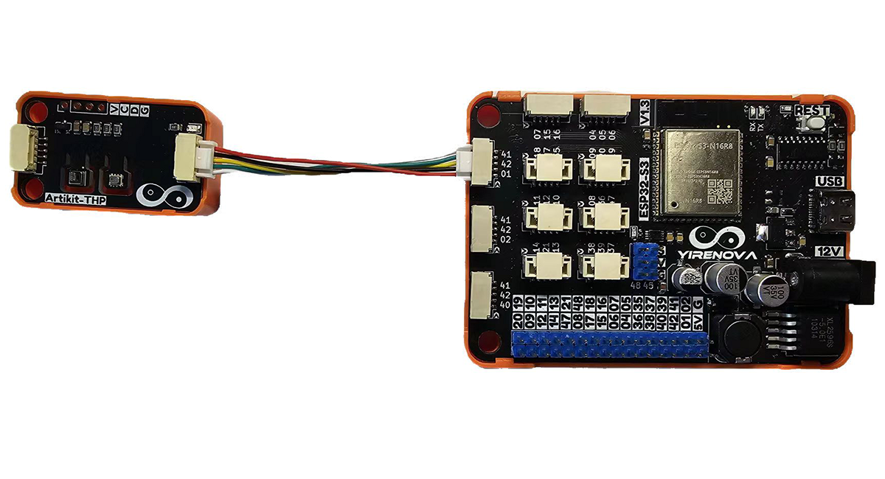
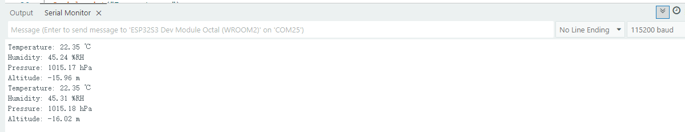

## ⭐ 简介
**🌡 温湿度**

AHT20 是一款 高精度、低功耗的数字温湿度传感器模块，采用 I2C 通信接口，支持同步测量环境温度（-40°C ~ 85°C）和相对湿度（0% RH ~ 100%RH），精度分别为 ±0.3°C 和 ±2%RH（25°C 时），适用于物联网（IoT）、智能家居、环境监测等场景。

**🏞️ 大气压强**

BMP280是一款基于博世公司APSM工艺的小封装低功耗数字复合传感器，它可以测量环境温度和大气压强。气压敏感元件是一个低噪高精度高分辨率绝对大气压力压电式感应元件；温度感测元件具有低噪高分辨率特性，温度值可以对气压进行温度补偿自校正。

<AccordionGroup>
<Accordion title="参数 & 接口 & 尺寸">

#### ⭐ 参数
- 🌡 温湿度
    - 工作电压：2 ~ 5.5V
    - 测量范围：-40 ~ 85℃（温度）
    - 测量范围：0 ~ 100%RH（湿度）
    - 测量精度：±0.3℃，±2%RH（25℃）
    - 分辨率：0.01℃，0.024%RH
- 🏞️ 大气压强
    - 工作温度：-40 ~ 85℃
    - 工作电压：1.7 ~ 3.6V
    - 测量范围：30Kpa ~ 1.1bar

#### ⭐ 接口


#### ⭐ 尺寸
- 📐 24mm x 40mm x 14.5mm



</Accordion>
</AccordionGroup>


## ⭐ 如何使用
<AccordionGroup>
<Accordion title="准备 & 硬件连接">
在Artikit-ESP32-S3主控板控制下，通过温湿度传感器和大气压强传感器获取环境状态信息。

#### ⭐ 准备
- 硬件
    - Artikit-ESP32-S3主控板 x1
    - Artikit-THP模组 x1
    - GH1.25连接线 x1
    - 12V直流电源 x1
    - PC电脑 x1
- 软件
[](https://arduino.cc/en/Main/Software)
    - 需要安装AHTX0库
    - 需要安装BMP280库

#### ⭐ 连接图

</Accordion>

<Accordion title="例程代码">

- 打开Arduino的程序编译环境，上传以下代码：
```c++ lightsensor.ino
#include <Wire.h>
#include <Adafruit_AHTX0.h>
#include <Adafruit_BMP280.h>

#define IIC_SDA_PIN     41
#define IIC_SCL_PIN     42
#define BMP280_ADDRESS  0x77

Adafruit_AHTX0 aht;
Adafruit_BMP280 bmp280;
void setup() 
{
  Wire.begin(IIC_SDA_PIN, IIC_SCL_PIN);
  Serial.begin(115200);
  if (!aht.begin()) {
     Serial.println("AHT20 Not connected");
     for (;;);
   }
  if (!bmp280.begin(BMP280_ADDRESS)) {
    Serial.println("BMP280 Not connected");
    for (;;);
  }
}
void loop() 
{
  sensors_event_t humidity, temp;
  aht.getEvent(&humidity, &temp);
  float press = bmp280.readPressure() / 100;
  float altitude = bmp280.readAltitude();

  Serial.print("Temperature: ");
  Serial.print(temp.temperature);
  Serial.println(" ℃");

  Serial.print("Humidity: ");
  Serial.print(humidity.relative_humidity);
  Serial.println(" %RH");

  Serial.print("Pressure: ");
  Serial.print(press);
  Serial.println(" hPa");

  Serial.print("Altitude: ");
  Serial.print(altitude);
  Serial.println(" m");
  delay(2000);
}
```
</Accordion>

<Accordion title="运行结果">
在Arduino IDE串口监视器可以查看到当前光照强度情况。

</Accordion>
</AccordionGroup>


## ⭐ 其他资料
<AccordionGroup>
<Accordion title="硬件原理图">
温湿度&大气压强传感器模块原理图 [<Badge color="blue" size="lg">下载</Badge>](../../public/resources/schematics/thp.pdf)
</Accordion>

<Accordion title="数据手册">
温湿度传感器模块数据手册 [<Badge color="blue" size="lg">下载</Badge>](../../public/resources/datasheet/AHT20.pdf)

大气压强传感器模块数据手册 [<Badge color="blue" size="lg">下载</Badge>](../../public/resources/datasheet/BMP280.pdf)
</Accordion>

</AccordionGroup>
